# AI-Driven-UI-Specification — QA Automation Suite

A Claude-native agent system for end-to-end UI test automation. From a live page URL to a full test execution report — with automatic spec generation, interactive improvement, and browser-driven test execution.

> **New here?** Read the [User Guide](user-guide.md) for a complete step-by-step walkthrough.

---

## Requirements & Installation

### Prerequisites

| Dependency                                                        | Minimum Version | Purpose                                            |
| ----------------------------------------------------------------- | --------------- | -------------------------------------------------- |
| [Node.js](https://nodejs.org/)                                    | v18+            | Runtime for `npx` and Playwright MCP server        |
| [npm](https://www.npmjs.com/)                                     | v9+             | Package manager (ships with Node.js)               |
| [Python 3](https://www.python.org/)                               | v3.8+           | Used by pipeline hooks for JSON parsing            |
| [Google Chrome](https://www.google.com/chrome/)                   | Latest stable   | Browser used by Playwright MCP in headed mode      |
| [Claude Code CLI](https://docs.anthropic.com/en/docs/claude-code) | Latest          | Agent runtime that executes the multi-agent system |
| Git                                                               | v2.30+          | Version control                                    |

### System Requirements

- **OS:** macOS, Linux, or Windows (WSL recommended on Windows)
- **RAM:** 4 GB minimum (8 GB recommended — Chrome + Claude Code run concurrently)
- **Disk:** ~500 MB for Chrome + Node.js dependencies

### Installation

#### 1. Install Node.js (if not already installed)

```bash
# macOS (Homebrew)
brew install node

# Ubuntu / Debian
curl -fsSL https://deb.nodesource.com/setup_18.x | sudo -E bash -
sudo apt-get install -y nodejs

# Or download from https://nodejs.org/
```

Verify:

```bash
node --version   # v18.x or higher
npx --version    # v9.x or higher
```

#### 2. Install Python 3 (if not already installed)

```bash
# macOS (Homebrew)
brew install python3

# Ubuntu / Debian
sudo apt-get install python3
```

Verify:

```bash
python3 --version   # 3.8 or higher
```

#### 3. Install Google Chrome

Download from [google.com/chrome](https://www.google.com/chrome/) or:

```bash
# macOS (Homebrew)
brew install --cask google-chrome
```

#### 4. Install Claude Code CLI

Follow the official installation guide at [docs.anthropic.com](https://docs.anthropic.com/en/docs/claude-code).

```bash
npm install -g @anthropic-ai/claude-code
```

#### 5. Clone the repository

```bash
git clone https://github.com/<your-org>/AI-Driven-UI-Specification-QA-Automation-Suite.git
cd AI-Driven-UI-Specification-QA-Automation-Suite
```

#### 6. Verify Playwright MCP server

The project uses `@playwright/mcp` via `npx` (no local install needed). Verify it can resolve:

```bash
npx -y @playwright/mcp@latest --help
```

This downloads the Playwright MCP server on first run. Subsequent runs use the cached version.

#### 7. Configure your target URL

Edit `vars.md` at the project root:

```
BASE_URL = https://your-app-domain.com
AUTH_EMAIL = your-login-email@example.com
AUTH_PASSWORD = your-login-password
```

`BASE_URL` is required. Authentication variables are optional — add them only if your pages require login. You can use any variable names you want (e.g. `ADMIN_EMAIL`, `USER_PASSWORD`, etc.) and reference them by name when invoking the agent.

#### 7b. Configure Figma access (optional — for design comparison)

If you plan to use Figma frame URLs for design comparison, set your Figma personal access token:

```bash
export FIGMA_ACCESS_TOKEN=your-figma-token-here
```

Generate a token from: Figma → Settings → Personal access tokens.

> This is only needed if you provide Figma URLs as design references. Pencil MCP (for `.pen` files) requires no additional configuration.

#### 8. Make hook scripts executable

```bash
chmod +x .claude/hooks/*.sh
```

### No `npm install` Required

This project has **no `package.json` or `node_modules`**. All browser automation runs through the Playwright MCP server invoked via `npx` at runtime. There are no test scripts to install or build steps to run.

### Quick Verification

Run this to confirm everything is ready:

```bash
node --version && python3 --version && npx --version && echo "✅ All dependencies available"
```

---

## How It Works

The system uses seven Claude agents organized into three stages: spec creation, test generation, and test execution. A pipeline state machine and shell hooks coordinate transitions between stages automatically.

```
┌────────────────────────────────────────────────────────────────────────────┐
│                            FULL PIPELINE                                   │
│                                                                            │
│  ┌─────────────────────────────────────────────────────────────────────┐   │
│  │  SPEC CREATION (3 agents)                                           │   │
│  │                                                                     │   │
│  │  spec-wizard-generate ──► {module}-description.md                   │   │
│  │         │                                                           │   │
│  │         ├── yes ──► spec-wizard-improve (interactive refinement)    │   │
│  │         │                    │                                      │   │
│  │         └── no ────────────-─┼──► spec-wizard-pipeline (summary)    │   │
│  │                              └──► spec-wizard-pipeline (summary)    │   │
│  └─────────────────────────────────────────────────────────────────────┘   │
│                                    │                                       │
│                              yes to pipeline                               │
│                                    ▼                                       │
│  ┌─────────────────────────────────────────────────────────────────────┐   │
│  │  QA PIPELINE (qa-coordinator + 2 agents)                            │   │
│  │                                                                     │   │
│  │  qa-coordinator                                                     │   │
│  │       │                                                             │   │
│  │       ├── test-generation ──► test-cases.md + test-data.md          │   │
│  │       │                                                             │   │
│  │       │   [PAUSE — user fills test-data.md]                         │   │
│  │       │                                                             │   │
│  │       └── test-execution ──► test-report-{module}.md + screenshots  │   │
│  └─────────────────────────────────────────────────────────────────────┘   │
└────────────────────────────────────────────────────────────────────────────┘
```



---

## Project Structure

```
.
├── .claude/
│   ├── agents/                          Claude agent definitions
│   │   ├── spec-wizard.md               Legacy entry point (delegates to spec-wizard-generate)
│   │   ├── spec-wizard-generate.md      Auto-generates spec from live page via Playwright
│   │   ├── spec-wizard-improve.md       Interactive section-by-section spec refinement
│   │   ├── spec-wizard-pipeline.md      Shows spec summary and offers QA pipeline
│   │   ├── qa-coordinator.md            Pipeline orchestrator (dispatches gen + exec)
│   │   ├── test-generation.md           Test case generator from spec
│   │   └── test-execution.md            Browser test executor via Playwright MCP
│   │
│   ├── skills/                          Agent skill instructions
│   │   ├── spec-wizard:auto-generate/
│   │   │   └── SKILL.md                 Auto-gen: navigate → analyze → write spec
│   │   ├── spec-wizard:improve/
│   │   │   └── SKILL.md                 9-section interactive improvement wizard
│   │   ├── spec-wizard:pipeline-offer/
│   │   │   └── SKILL.md                 Summarize spec → offer QA pipeline
│   │   ├── spec-wizard:process/
│   │   │   └── SKILL.md                 12-phase full wizard (legacy, used by spec-wizard.md)
│   │   ├── test-generation:process/
│   │   │   └── SKILL.md                 6-step test case generation
│   │   └── test-execution:process/
│   │       └── SKILL.md                 6-step browser test execution
│   │
│   ├── hooks/                           Pipeline state machine hooks
│   │   ├── pipeline-on-user-prompt.sh   Routes user responses to next pipeline stage
│   │   ├── pipeline-on-spec-created.sh  Detects spec file writes → updates state
│   │   ├── pipeline-on-tests-generated.sh  Detects test-cases.md writes → updates state
│   │   └── pipeline-on-report-written.sh   Detects report writes → marks complete
│   │
│   ├── .pipeline-state                  Current pipeline state (auto-managed)
│   └── settings.local.json             Permissions, MCP servers, hook configuration
│
├── Platform/                            Module output directory
│   └── {ModuleName}/                    One folder per UI screen
│       ├── {module}-description.md      UI screen spec (created by spec-wizard)
│       ├── {module}-analysis.png        Screenshot from wizard analysis
│       ├── test-cases.md                Generated test cases (data-agnostic)
│       ├── test-data.md                 Fillable test data template
│       ├── test-report-{module}.md      Execution report with pass/fail/blocked
│       └── TC-*.png                     Screenshot evidence from test execution
│
├── TEMPLATE.md                          Canonical spec format and conventions
├── vars.md                              Project-level configuration (BASE_URL)
├── .mcp.json                            Playwright MCP server configuration
├── README.md                            This file
└── user-guide.md                        Step-by-step usage walkthrough
```

---

## Agents

### `spec-wizard-generate` — Auto Spec Generator

> **Model:** Opus · **Skill:** `spec-wizard:auto-generate` · **MCP:** `playwright_headed`

Navigates to a live page with Playwright MCP, analyzes the full DOM (including scrolling, tabs, and expandable sections), and produces a complete `{module}-description.md` spec file in one pass — no interactive interview required.

After saving, offers two paths:

- **Yes** → launches `spec-wizard-improve` for interactive refinement
- **No** → launches `spec-wizard-pipeline` to offer the QA pipeline

| Input               | Required | Description                                                                                                                                     |
| ------------------- | -------- | ----------------------------------------------------------------------------------------------------------------------------------------------- |
| `PAGE_URL`          | Yes      | Full URL or path to analyze                                                                                                                     |
| `MODULE_NAME`       | No       | Kebab-case name (derived from URL if omitted)                                                                                                   |
| `AUTH_REQUIRED`     | No       | Whether the page needs login first                                                                                                              |
| `LOGIN_ROUTE`       | If auth  | Route or URL of the login page                                                                                                                  |
| `AUTH_EMAIL_VAR`    | If auth  | Variable name in `vars.md` for login email/username (e.g. `AUTH_EMAIL`). Credentials are never hardcoded — always read from `vars.md`.          |
| `AUTH_PASSWORD_VAR` | If auth  | Variable name in `vars.md` for login password (e.g. `AUTH_PASSWORD`). Credentials are never hardcoded — always read from `vars.md`.             |
| `DESTINATION_ROUTE` | If auth  | Page to analyze after login                                                                                                                     |
| `OUTPUT_DIR`        | No       | Output directory (default: `Platform/{ModuleName}/`)                                                                                            |
| `DESIGN_REFERENCE`  | No       | Pencil slide name or Figma frame URL for design comparison. Populates the "Pencil slide name / Figma frame URL" field in Screen Identification. |

**Output:** `Platform/{ModuleName}/{module}-description.md`

---

### `spec-wizard-improve` — Interactive Spec Refinement

> **Model:** Opus · **Skill:** `spec-wizard:improve`

Takes an existing spec file and walks through all 9 content sections in order. For each section it shows the current content, asks targeted questions, applies changes, and waits for explicit confirmation before advancing.

After saving, automatically invokes `spec-wizard-pipeline`.

| Input          | Required | Description                                  |
| -------------- | -------- | -------------------------------------------- |
| `SPEC_FILE`    | Yes      | Path to the existing spec `.md` file         |
| `PROJECT_ROOT` | No       | Project root path (auto-detected if omitted) |

**Sections reviewed (in order):**

1. Screen Identification
2. Origin Context
3. Components (one at a time, with field-level questions)
4. View-Level Fields
5. Screen States
6. Related Views
7. Business Rules
8. Actions and Transitions
9. Detailed Flow Description

---

### `spec-wizard-pipeline` — Pipeline Offer

> **Model:** Opus · **Skill:** `spec-wizard:pipeline-offer`

Reads a completed spec file, shows a structured summary (components, fields, states, rules, actions), and offers to launch the full QA pipeline via `qa-coordinator`.

| Input          | Required | Description                                  |
| -------------- | -------- | -------------------------------------------- |
| `SPEC_FILE`    | Yes      | Path to the completed spec file              |
| `PROJECT_ROOT` | No       | Project root path (auto-detected if omitted) |

---

### `qa-coordinator` — Pipeline Orchestrator

> **Model:** Opus · **Dispatches:** `test-generation`, `test-execution`

Collects a spec file path, then runs the full pipeline or individual stages. Always uses headed browser mode. Pauses between generation and execution for the user to fill `test-data.md`.

| Mode                        | Trigger                                       |
| --------------------------- | --------------------------------------------- |
| **Full Pipeline** (default) | No specific stage mentioned                   |
| **Generate Only**           | "generate", "test cases only", "create tests" |
| **Execute Only**            | "execute", "run tests", "only execute"        |

**Pipeline flow:**

```
spec file → test-generation → test-cases.md + test-data.md
                                    │
                              [PAUSE — fill test-data.md]
                                    │
                              test-execution → test-report-{module}.md + screenshots
```

---

### `test-generation` — Test Case Generator

> **Model:** Sonnet · **Skill:** `test-generation:process`

Reads a spec file and produces two artifacts:

- `test-cases.md` — complete, data-agnostic test cases using `${field-name}` placeholders
- `test-data.md` — fillable template with empty slots organized by scenario

**Coverage types:** Happy Path · Smoke · Functional · Edge Cases · Exploratory · Design Comparison (when design reference is provided)

---

### `test-execution` — Browser Test Executor

> **Model:** Sonnet · **Skill:** `test-execution:process` · **MCP:** `playwright_headed`, `figma`, `pencil`

Reads `test-cases.md` and `test-data.md`, hydrates placeholders with concrete values, executes every test sequentially via Playwright MCP, captures screenshots, and generates a structured report in technical English. For Design Comparison test cases, retrieves the original design from Figma MCP or Pencil MCP and compares it against the live implementation, documenting all visual and structural discrepancies.

| Status     | Condition                                                 |
| ---------- | --------------------------------------------------------- |
| ✅ PASS    | All steps completed and expected result matched           |
| ❌ FAIL    | One or more steps did not match the expected result       |
| ⚠️ BLOCKED | Test could not run due to environment or data limitations |

---

### `spec-wizard` — Legacy Entry Point

> **Model:** Opus · Delegates to `spec-wizard-generate`

Kept for backward compatibility. When invoked, behaves as `spec-wizard-generate`. Prefer using the specific agents directly.

---

## Skills

Each agent loads its skill file at the start of every session. Skills contain step-by-step execution instructions that agents follow exactly.

| Skill                        | Purpose                                                                |
| ---------------------------- | ---------------------------------------------------------------------- |
| `spec-wizard:auto-generate`  | Navigate → analyze DOM → generate complete spec in one pass            |
| `spec-wizard:improve`        | 9-section interactive wizard for refining an existing spec             |
| `spec-wizard:pipeline-offer` | Summarize spec → offer QA pipeline dispatch                            |
| `spec-wizard:process`        | 12-phase full wizard with interview (legacy)                           |
| `test-generation:process`    | Read spec → determine coverage → write test-cases.md + test-data.md    |
| `test-execution:process`     | Hydrate → execute via Playwright MCP → classify results → write report |

---

## Pipeline State Machine

The system uses shell hooks and a `.pipeline-state` file to track progress through the automation pipeline. State transitions happen automatically based on file writes and user responses.

**States:**

```
SPEC_AUTO_GENERATED → user says yes → WIZARD_REQUESTED → wizard saves → WIZARD_COMPLETE
                    → user says no  → PIPELINE_OFFER_REQUESTED
                                                         ↓
                                              qa-coordinator dispatched
                                                         ↓
                                              GENERATION_COMPLETE
                                                         ↓
                                              user says "done" / "ready"
                                                         ↓
                                              TEST_DATA_READY
                                                         ↓
                                              test-execution dispatched
                                                         ↓
                                              EXECUTION_COMPLETE
```

**Hooks:**

| Hook                             | Trigger            | Purpose                                      |
| -------------------------------- | ------------------ | -------------------------------------------- |
| `pipeline-on-user-prompt.sh`     | Every user message | Routes "yes/no/done" responses to next stage |
| `pipeline-on-spec-created.sh`    | After Write tool   | Detects spec file creation in `Platform/`    |
| `pipeline-on-tests-generated.sh` | After Write tool   | Detects `test-cases.md` creation             |
| `pipeline-on-report-written.sh`  | After Write tool   | Detects `test-report-*.md` creation          |

---

## Configuration

### `vars.md` — Project configuration

```
BASE_URL = https://www.google.com
AUTH_EMAIL = admin@example.com
AUTH_PASSWORD = mypassword123
```

All agents read `vars.md` from the project root to resolve `BASE_URL`. This domain is prepended to every route in spec files to form full URLs. Authentication credentials are also stored here as named variables — agents reference them by variable name (e.g. `email: AUTH_EMAIL, password: AUTH_PASSWORD`) and read the actual values from this file at runtime. This keeps credentials out of prompts and chat history.

You can define custom variable names for different environments or roles:

```
BASE_URL = https://staging.myapp.com
ADMIN_EMAIL = admin@myapp.com
ADMIN_PASSWORD = admin-secret
USER_EMAIL = user@myapp.com
USER_PASSWORD = user-secret
```

Update these values when your environment or credentials change.

### `.mcp.json` — Playwright MCP server

```json
{
  "mcpServers": {
    "playwright_headed": {
      "command": "npx",
      "args": ["-y", "@playwright/mcp@latest", "--browser", "chrome"]
    },
    "figma": {
      "command": "npx",
      "args": ["-y", "@anthropic/figma-mcp@latest"],
      "env": {
        "FIGMA_ACCESS_TOKEN": "${FIGMA_ACCESS_TOKEN}"
      }
    }
  }
}
```

Two MCP servers are configured:

- **`playwright_headed`** — All agents use `mcp__playwright_headed__` prefixed tool calls for browser automation. No programmatic Playwright code is ever written or executed.
- **`figma`** — Used by `test-execution` for Design Comparison test cases when a Figma frame URL is provided. Requires a `FIGMA_ACCESS_TOKEN` environment variable. Generate a personal access token from Figma → Settings → Personal access tokens.

For **Pencil MCP** (design comparison with `.pen` files), the Pencil MCP tools are available through the Kiro Pencil power — no additional configuration needed.

---

## Spec Format — `TEMPLATE.md`

Every UI screen is described in a single `{module}-description.md` file following the conventions in `TEMPLATE.md`. The spec-wizard agents create these files; you can also create or edit them manually.

### ID conventions

| Entity              | Format                   | Example                              |
| ------------------- | ------------------------ | ------------------------------------ |
| View                | `<<readable-name-uuid>>` | `<<login-page-eea0589e-...>>`        |
| Component           | `<<readable-name-uuid>>` | `<<login-form-ca815574-...>>`        |
| Business Rule       | `<<rule-name-uuid>>`     | `<<auth-rule-f3a9c1b2>>`             |
| Interactive element | `${field-name}`          | `${login-email}`, `${submit-button}` |

### Spec sections

| Section                   | Description                                                           |
| ------------------------- | --------------------------------------------------------------------- |
| Screen Identification     | View ID, Name, Version, Route, Design Reference (Pencil/Figma)        |
| Origin Context            | Previous view and start flow                                          |
| Components                | Named UI sections with fields, validations, and component-level rules |
| View-Level Fields         | Interactive elements not belonging to any component                   |
| Screen States             | Named states and transitions (loading, error, success, empty)         |
| Related Views             | Spec-file dependencies and external services for cross-view testing   |
| Business Rules            | Domain rules beyond individual field validations                      |
| Actions and Transitions   | Every user-triggered action and its expected reaction                 |
| Detailed Flow Description | Step-by-step narrative using `<<view-ids>>` and `${field-names}`      |

---

## Workflow Examples

### Create a spec from a live page (auto-generate + improve)

```
Invoke: spec-wizard-generate
"Create a spec for /vacantes, login at /login with email: AUTH_EMAIL, password: AUTH_PASSWORD, destination /vacantes"
→ auto-generates Platform/Vacantes/vacantes-description.md
→ asks: "Run the improvement wizard?" → yes
→ spec-wizard-improve walks through 9 sections
→ spec-wizard-pipeline shows summary and offers QA pipeline → yes
→ qa-coordinator generates tests, pauses for test-data.md
→ you fill test-data.md → confirm
→ test-execution runs and delivers the report
```

### Create a spec with design comparison

```
Invoke: spec-wizard-generate
"Create a spec for /dashboard, login at /login with email: AUTH_EMAIL, password: AUTH_PASSWORD, design reference: https://www.figma.com/design/abc123/MyProject?node-id=1234-5678"
→ auto-generates spec with Figma frame URL in Screen Identification
→ test generation includes a TC-DC-01 Design Comparison test case
→ test execution retrieves the Figma design and compares against the live page
→ report includes a DESIGN COMPARISON section with discrepancy details
```

### Create a spec with Pencil design reference

```
Invoke: spec-wizard-generate
"Create a spec for /login, design reference: Login Screen"
→ auto-generates spec with Pencil slide name in Screen Identification
→ test generation includes a TC-DC-01 Design Comparison test case
→ test execution retrieves the Pencil design and compares against the live page
→ report includes a DESIGN COMPARISON section with discrepancy details
```

### Run the pipeline on an existing spec

```
Invoke: qa-coordinator
"Run the full QA pipeline for Platform/Login/login-description.md"
→ dispatches test-generation → test-cases.md + test-data.md
→ pauses: "Fill test-data.md and confirm when ready"
→ you fill test-data.md → confirm
→ dispatches test-execution → test-report-login.md generated
```

### Generate test cases only

```
Invoke: qa-coordinator
"Generate test cases only for Platform/Dashboard/dashboard-description.md"
→ dispatches test-generation → done
```

### Execute tests on already-filled test data

```
Invoke: qa-coordinator
"Execute tests for Platform/Login/login-description.md"
→ verifies test-cases.md and test-data.md exist
→ dispatches test-execution → report generated
```

---

## Traceability

Every artifact is linked:

```
{module}-description.md
    └── test-cases.md          references <<view-id>> and ${field-names} from spec
    └── test-data.md           provides concrete values per scenario
    └── test-report-{module}.md  records PASS/FAIL/BLOCKED per TC ID
    └── TC-*.png               screenshot evidence linked to TC IDs in the report
```

Test IDs follow the format `TC-{TYPE}-{NN}` (e.g. `TC-SMK-01`, `TC-HP-01`, `TC-001`).
