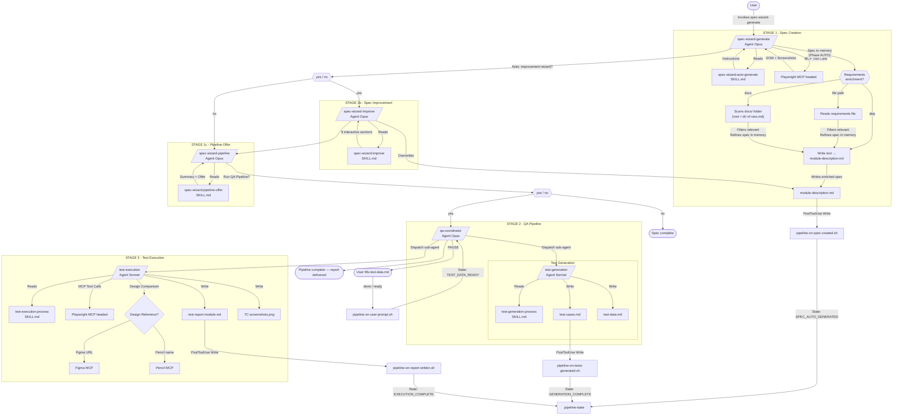
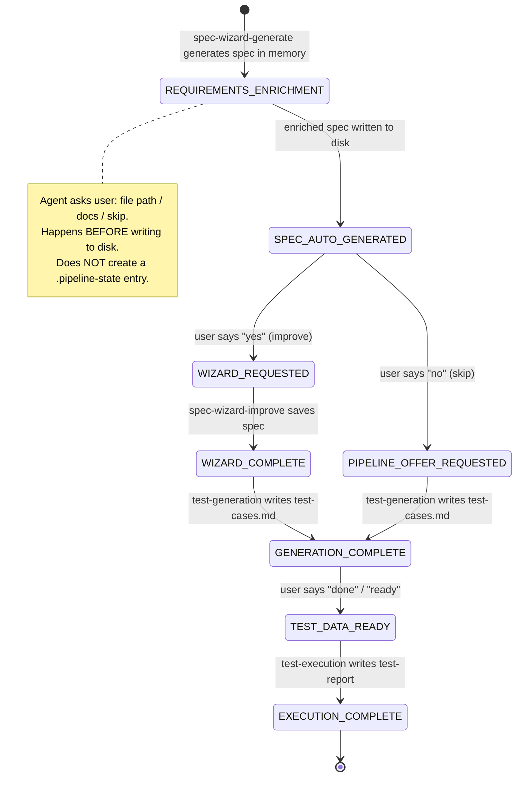

# Architecture Reference — Agents, Skills, and Hooks in Claude Code

This document is a deep-dive into the internals of the AI-Driven-UI-Specification plugin. It explains what agents, skills, and hooks are, how they work together, and how to modify or extend any part of the system.

If you just want to use the pipeline, read [user-guide.md](user-guide.md) instead. Come here when you want to understand why the system works the way it does, or when you want to fork and extend it.

---

## Plugin and Repository Structure

This repository is both the source code and the Claude Code plugin. The repo root is the plugin root — there is no nested source directory.

```
.                                    ← repo root = plugin root
├── package.json                     Plugin manifest: declares name, creator, file mapping
├── settings.json                    Hook event configuration + MCP server permissions
├── .mcp.json                        Playwright and Figma MCP server definitions
│
├── agents/                          Agent definitions (one .md file per agent)
├── skills/                          Step-by-step execution instructions (one dir per skill)
├── hooks/                           Pipeline state machine (bash scripts)
│
├── TEMPLATE.md                      Canonical spec format — read by every agent
├── vars.md                          User-filled config: BASE_URL + credentials
├── user-guide.md                    End-user walkthrough
├── README.md                        Project overview and install instructions
├── INSTALL.md                       Detailed setup guide
└── personal-explanation.md          This file — architecture reference
```

When `claude plugin install` runs, it reads `package.json` and installs:
- `agents/*.md` → `.claude/agents/`
- `skills/**` → `.claude/skills/`
- `hooks/*.sh` → `.claude/hooks/` (made executable automatically)
- `settings.json` → merged into `.claude/settings.json`
- `.mcp.json` → merged into `.mcp.json`
- Root files → project root

The `Platform/` and `docs/` folders are **not** part of the plugin. The user creates `Platform/` themselves (`mkdir Platform`). The `docs/` folder is optional and user-managed — the plugin never touches it.

---

## System Flow Diagram



---

## 1. What is an Agent?

An **Agent** is an isolated Claude instance with its own context window, system prompt, tool access, and permissions. When the main Claude session encounters a task that matches an agent's description, it delegates the work to that agent, which operates independently and returns only the result.

### Key characteristics

- **Isolated context**: each agent has its own context window — it cannot see the main conversation history
- **Own system prompt**: defined in the markdown body of the agent's `.md` file
- **Restricted tools**: you can limit which tools it can use (Read, Write, Bash, MCP tools, etc.)
- **Configurable model**: can use a different model than the main session (opus, sonnet, haiku)
- **Independent permissions**: can have its own permission mode

### Syntax — Agent definition file

Agents are defined as markdown files with YAML frontmatter in `agents/` (in the plugin repo) or `.claude/agents/` (in a user's project after installation):

```markdown
---
name: my-agent
description: Description of when to use this agent. Claude uses this to decide when to delegate.
model: claude-sonnet-4-6
color: "#16A34A"
tools: Read, Write, Bash, Glob, Grep, mcp__playwright_headed
---

This is the agent's system prompt.
Everything here is what the agent "knows" and follows as instructions.
```

### Frontmatter fields

| Field | Required | Description |
|---|---|---|
| `name` | Yes | Unique kebab-case identifier |
| `description` | Yes | When Claude should delegate to this agent |
| `tools` | No | Allowed tools (inherits all if omitted) |
| `disallowedTools` | No | Explicitly denied tools |
| `model` | No | Model: `sonnet`, `opus`, `haiku`, or full model ID |
| `permissionMode` | No | `default`, `acceptEdits`, `auto`, or `bypassPermissions` |
| `maxTurns` | No | Maximum turns before stopping |
| `color` | No | Background color in the UI |

### How an agent dispatches sub-agents

In this project, `qa-coordinator` dispatches `test-generation` and `test-execution` using the `Agent()` tool declaration in its frontmatter:

```markdown
---
name: qa-coordinator
tools: Read, Glob, Agent(test-generation, test-execution)
---
```

The `Agent(test-generation, test-execution)` field is what permits this agent to invoke those two as sub-agents. Sub-agents are started by the orchestrator using the Agent tool — each runs in its own isolated context and returns a result.

### How agents are invoked

1. **Automatically**: Claude decides to delegate based on the `description` field
2. **Explicitly**: the user switches to the agent or says "use spec-wizard-generate"
3. **From another agent**: using `Agent(name)` in the tools field and calling the Agent tool
4. **As the main session**: `claude --agent my-agent`

---

## 2. What is a Skill?

A **Skill** is a `SKILL.md` file with step-by-step instructions that extend Claude's capabilities. Think of it as a playbook — a precise set of instructions that Claude loads into its context and follows exactly. Unlike `CLAUDE.md` (which is always in context), a skill is loaded only when needed.

### Key characteristics

- **On-demand loading**: the skill's content only enters context when the agent reads it
- **Detailed instructions**: can contain complex multi-step procedures
- **No independent execution**: skills don't run anything on their own — the agent reads them and acts on them
- **Argument support**: supports `$ARGUMENTS`, `$0`, `$1`, etc.

### Skill location

In the plugin repo:
```
skills/
└── my-skill:process/
    └── SKILL.md
```

After installation in a user's project:
```
.claude/skills/
└── my-skill:process/
    └── SKILL.md
```

The subdirectory naming convention `skill-name:variant` is a colon-separated namespace. For example, `spec-wizard:auto-generate` and `spec-wizard:improve` are two variants of the spec-wizard skill family.

### How agents use skills

Every agent in this project loads its skill at startup using the `Read` tool:

```markdown
## Skill Loading

Before doing anything else, read your skill file:

1. Use the `Read` tool to load: `.claude/skills/my-skill:process/SKILL.md`
   - If PROJECT_ROOT was provided: `{PROJECT_ROOT}/.claude/skills/...`
   - If not: use Glob to find `vars.md` and derive the project root
2. Follow every step in the skill file completely and in order.
```

This pattern — agent reads skill, then executes its steps — is how all seven agents in this plugin work.

### Difference: Skill vs Agent

| Aspect | Skill | Agent |
|---|---|---|
| Context | Loaded IN the current conversation | Has its OWN isolated context |
| Intelligence | No — it's text that a model reads | Yes — it's a full LLM instance |
| Tools | Uses the session's tools | Has its own defined tools |
| Interactivity | Can be multi-turn in the same conversation | Works autonomously |
| Ideal use | Detailed procedures the agent must follow | Isolated tasks that produce significant output |

---

## 3. What is a Hook?

A **Hook** is a shell script that runs automatically at specific points in the Claude Code lifecycle. Hooks are **deterministic** — they always execute when the triggering condition is met, regardless of what the LLM decides.

### Key characteristics

- **Deterministic**: always execute when the event fires — not subject to LLM judgment
- **Event-driven**: triggered at specific lifecycle moments (after Write, before a tool, on user message)
- **Communicate via stdin/stdout/stderr**: receive JSON on stdin, return decisions via exit code or context via stdout
- **Can block actions**: exit code 2 blocks the action and sends stderr as feedback to Claude
- **Can inject context**: stdout in certain events is added to Claude's context window
- **Run in parallel**: multiple hooks for the same event run simultaneously

### Hook configuration in settings.json

```json
{
  "hooks": {
    "PostToolUse": [
      {
        "matcher": "Write",
        "hooks": [
          {
            "type": "command",
            "command": ".claude/hooks/pipeline-on-spec-created.sh"
          }
        ]
      }
    ],
    "UserPromptSubmit": [
      {
        "hooks": [
          {
            "type": "command",
            "command": ".claude/hooks/pipeline-on-user-prompt.sh"
          }
        ]
      }
    ]
  }
}
```

The commands use project-relative paths (`.claude/hooks/...`), which works in any project once the hooks are installed.

### Available events

| Event | When it fires | Matcher filters by |
|---|---|---|
| `SessionStart` | Session start or resume | `startup`, `resume`, `clear`, `compact` |
| `UserPromptSubmit` | When the user sends a message | (no matcher) |
| `PreToolUse` | Before a tool executes | Tool name: `Bash`, `Edit\|Write`, `mcp__.*` |
| `PostToolUse` | After a tool executes | Tool name |
| `PermissionRequest` | When a permission dialog appears | Tool name |
| `Stop` | When Claude finishes responding | (no matcher) |
| `SubagentStart` | When a sub-agent is created | Agent type |
| `SubagentStop` | When a sub-agent finishes | Agent type |

### Exit codes

| Exit Code | Meaning |
|---|---|
| `0` | Action permitted. stdout is added to context (in certain events). |
| `2` | Action blocked. stderr is sent as feedback to Claude. |
| Other | Error — action continues, warning shown in transcript. |

### Hook portability — how the scripts resolve paths

All four hooks in this plugin use the same pattern to find the project root without hardcoding any paths:

```bash
#!/bin/bash
SCRIPT_DIR="$(cd "$(dirname "${BASH_SOURCE[0]}")" && pwd)"
PROJECT="$(cd "$SCRIPT_DIR/../.." && pwd)"
STATE_FILE="$PROJECT/.claude/.pipeline-state"
```

Because hooks are always installed at `.claude/hooks/`, `$SCRIPT_DIR` resolves to `<project>/.claude/hooks` and `$PROJECT` resolves two levels up to the project root. This makes every hook fully portable — the same script works correctly in any project.

### Example — `pipeline-on-spec-created.sh`

```bash
#!/bin/bash
# Fires after every Write tool call.
# Detects when a spec file is written inside Platform/ and updates pipeline state.

SCRIPT_DIR="$(cd "$(dirname "${BASH_SOURCE[0]}")" && pwd)"
PROJECT="$(cd "$SCRIPT_DIR/../.." && pwd)"
STATE_FILE="$PROJECT/.claude/.pipeline-state"

INPUT=$(cat)

FILE=$(echo "$INPUT" | python3 -c \
  "import sys,json; d=json.load(sys.stdin); print(d.get('tool_input',{}).get('file_path',''))" \
  2>/dev/null || echo "")

[[ -z "$FILE" ]] && exit 0

# Match: Platform/**/*-description.md
if [[ "$FILE" == "$PROJECT/Platform/"* ]] && \
   [[ "$FILE" =~ \-description\.md$ ]]; then

  MODULE_DIR=$(dirname "$FILE")
  MODULE=$(basename "$MODULE_DIR")

  printf "SPEC_AUTO_GENERATED\n%s\n%s\n" "$MODULE" "$FILE" > "$STATE_FILE"
fi

exit 0
```

The JSON received on stdin for a `PostToolUse` Write event looks like:

```json
{
  "session_id": "abc123",
  "hook_event_name": "PostToolUse",
  "tool_name": "Write",
  "tool_input": {
    "file_path": "/path/to/project/Platform/Login/login-description.md",
    "content": "..."
  }
}
```

### Example — Hook that injects context (UserPromptSubmit)

```bash
#!/bin/bash
# Detects when the user says "done" and injects a dispatch instruction into Claude's context.

SCRIPT_DIR="$(cd "$(dirname "${BASH_SOURCE[0]}")" && pwd)"
PROJECT="$(cd "$SCRIPT_DIR/../.." && pwd)"
STATE_FILE="$PROJECT/.claude/.pipeline-state"

INPUT=$(cat)
PROMPT=$(echo "$INPUT" | python3 -c \
  "import sys,json; d=json.load(sys.stdin); print(d.get('prompt','').lower())" \
  2>/dev/null || echo "")

CURRENT_STATE=$(sed -n '1p' "$STATE_FILE" 2>/dev/null || echo "")

if [[ "$CURRENT_STATE" == "GENERATION_COMPLETE" ]] && \
   echo "$PROMPT" | grep -qiE "(done|ready|filled)"; then
  # stdout is injected into Claude's context
  cat <<MSG
The user has confirmed test data is ready.
Dispatch the test-execution agent now.
MSG
fi

exit 0
```

### Example — Hook that blocks an action (PreToolUse)

```bash
#!/bin/bash
# Blocks writes to .env files.

INPUT=$(cat)
FILE_PATH=$(echo "$INPUT" | python3 -c \
  "import sys,json; d=json.load(sys.stdin); print(d.get('tool_input',{}).get('file_path',''))" \
  2>/dev/null || echo "")

if [[ "$FILE_PATH" == *".env"* ]]; then
  echo "Blocked: Cannot modify .env files" >&2
  exit 2  # EXIT 2 = BLOCK
fi

exit 0  # EXIT 0 = ALLOW
```

---

## 4. How They Work Together — Agent + Skill + Hook

### The mental model

Think of them as three layers of the system:

```
┌─────────────────────────────────────────────────────────────────┐
│  HOOKS (Infrastructure layer)                                   │
│  • Deterministic — always execute when the event fires          │
│  • Observe system events (file writes, user messages)           │
│  • Can block, inject context, or update state                   │
│  • NO intelligence — pure shell scripts                         │
└─────────────────────────────────────────────────────────────────┘
         ▲ fire when events occur ▲
         │                         │
┌─────────────────────────────────────────────────────────────────┐
│  AGENTS (Orchestration layer)                                   │
│  • Isolated Claude instances with their own context             │
│  • Decide what to do based on their system prompt               │
│  • Can dispatch other agents (sub-agents)                       │
│  • Use tools (Read, Write, Bash, MCP tools)                     │
│  • Their actions TRIGGER hooks                                  │
└─────────────────────────────────────────────────────────────────┘
         ▲ load and follow ▲
         │                   │
┌─────────────────────────────────────────────────────────────────┐
│  SKILLS (Knowledge layer)                                       │
│  • Step-by-step instructions that agents follow                 │
│  • Loaded into the agent's context when needed                  │
│  • Define the "how" — the exact procedure                       │
│  • Do NOT execute anything by themselves                        │
│  • The playbook that the agent reads and acts on                │
└─────────────────────────────────────────────────────────────────┘
```

### Analogy

| Concept | Analogy |
|---|---|
| **Agent** | A specialist employee with their own desk and tools |
| **Skill** | The procedure manual the employee reads and follows |
| **Hook** | The building's alarm system — fires automatically when something happens |

### Detailed execution trace

Here is exactly what happens when a user says "Create a spec for /dashboard":

```
1. USER → "Create a spec for /dashboard"
   │
   ├── [AGENT] spec-wizard-generate activates
   │   │
   │   ├── [SKILL] Reads .claude/skills/spec-wizard:auto-generate/SKILL.md
   │   │   └── Now knows exactly what to do (phases 0 → AUTO → REQUIREMENTS → Write)
   │   │
   │   ├── [AGENT] Phase 0: Collects inputs from user
   │   ├── [AGENT] Reads vars.md → extracts BASE_URL + credentials
   │   ├── [AGENT] Phase 1: Navigates with Playwright MCP
   │   │   └── browser_navigate → browser_snapshot → browser_take_screenshot
   │   ├── [AGENT] Phase AUTO: Generates complete spec IN MEMORY
   │   │
   │   ├── [AGENT] Phase REQUIREMENTS: Requirements enrichment
   │   │   └── Asks user: "file path / docs / skip?"
   │   │
   │   │   ├── USER → "/path/to/requirements.md" (or "docs")
   │   │   │   ├── [AGENT] Reads the file (Read tool)
   │   │   │   │   If "docs": locates vars.md via Glob → its parent dir is project root
   │   │   │   │   → scans {root}/docs/*.md and *.csv
   │   │   │   ├── [AGENT] Filters requirements relevant to this module
   │   │   │   └── [AGENT] Refines spec IN MEMORY (does not write yet)
   │   │   │
   │   │   └── USER → "skip" → continues without changes
   │   │
   │   └── [AGENT] Write → Platform/Dashboard/dashboard-description.md
   │       │    (enriched spec)
   │       │
   │       └── [HOOK fires] pipeline-on-spec-created.sh
   │           └── Detects *-description.md written under Platform/
   │           └── Writes "SPEC_AUTO_GENERATED" to .pipeline-state
   │
   ├── [AGENT] Asks: "Improvement wizard?"
   │   │
   │   └── USER → "no"
   │       │
   │       └── [HOOK fires] pipeline-on-user-prompt.sh
   │           └── Reads .pipeline-state → state = SPEC_AUTO_GENERATED
   │           └── Detects "no" → updates state to PIPELINE_OFFER_REQUESTED
   │
   ├── [AGENT] spec-wizard-pipeline activates
   │   ├── [SKILL] Reads .claude/skills/spec-wizard:pipeline-offer/SKILL.md
   │   └── Reads spec, shows summary, asks "Run QA Pipeline?"
   │
   └── USER → "yes"
       │
       ├── [AGENT] qa-coordinator activates
       │   │
       │   ├── [AGENT dispatches] test-generation (sub-agent)
       │   │   ├── [SKILL] Reads .claude/skills/test-generation:process/SKILL.md
       │   │   ├── [AGENT] Reads spec + vars.md, generates test cases
       │   │   ├── [AGENT] Write → test-cases.md
       │   │   │   └── [HOOK fires] pipeline-on-tests-generated.sh
       │   │   │       └── State → GENERATION_COMPLETE
       │   │   └── [AGENT] Write → test-data.md
       │   │
       │   ├── [AGENT] qa-coordinator PAUSES
       │   │   └── "Fill test-data.md and confirm when ready"
       │   │
       │   ├── USER → "done"
       │   │   └── [HOOK fires] pipeline-on-user-prompt.sh
       │   │       └── State = GENERATION_COMPLETE + "done" detected
       │   │       └── State → TEST_DATA_READY
       │   │       └── stdout: "Dispatch test-execution agent"
       │   │           (this text is injected into Claude's context)
       │   │
       │   └── [AGENT dispatches] test-execution (sub-agent)
       │       ├── [SKILL] Reads .claude/skills/test-execution:process/SKILL.md
       │       ├── [AGENT] Hydrates test cases with test data
       │       ├── [AGENT] Executes each test via Playwright MCP
       │       │   └── navigate → snapshot → type → click → screenshot
       │       ├── [AGENT] Design Comparison (if TC-DC exists):
       │       │   ├── Figma URL → uses Figma MCP to retrieve design
       │       │   └── Pencil name → uses Pencil MCP to retrieve design
       │       ├── [AGENT] Write → test-report-dashboard.md
       │       │   └── [HOOK fires] pipeline-on-report-written.sh
       │       │       └── State → EXECUTION_COMPLETE
       │       └── [AGENT] Write → TC-*.png (screenshots)
       │
       └── [AGENT] qa-coordinator delivers final report
           └── "✅ QA Pipeline Complete"
```

---

## 5. The Pipeline State Machine

The hooks implement a **state machine** using a `.pipeline-state` file at `.claude/.pipeline-state`. This lets multiple agents coordinate across time without any single agent needing to "remember" the full pipeline state — the state is persisted on disk between turns.



**How the state machine works:**

1. **Hooks OBSERVE** — each hook reads the current state from `.pipeline-state`
2. **Hooks UPDATE** — when they detect a relevant event, they write the new state
3. **Hooks INJECT** — in certain states, they write to stdout, which Claude Code injects into the agent's context as additional instructions
4. **Agents don't know about hooks** — agents follow their skills; hooks coordinate transitions invisibly between them

**Why use hooks instead of having the agent remember:**

- **Reliability**: hooks are deterministic — they always execute
- **Decoupling**: each agent is independent and doesn't need to know the full pipeline
- **Persistence**: state survives across sessions (it's a file on disk)
- **Simplicity**: each agent only knows its own task

---

## 6. Comparison Table

| Aspect | Agent | Skill | Hook |
|---|---|---|---|
| **What it is** | Isolated Claude instance | Instructions file | Automatic shell script |
| **Intelligence** | Yes — full LLM | No — text a model reads | No — deterministic code |
| **When it runs** | When Claude delegates or user invokes | When an agent loads it with Read | When the lifecycle event fires |
| **Context** | Own isolated context | Loaded IN the agent's context | No Claude context |
| **Can use tools** | Yes (Read, Write, Bash, MCP, etc.) | No — the agent uses tools | No — only shell commands |
| **Can make decisions** | Yes — reasons and decides | No — only provides instructions | Binary: allow/block |
| **Location in repo** | `agents/*.md` | `skills/<name>/SKILL.md` | `hooks/*.sh` |
| **Location in project** | `.claude/agents/*.md` | `.claude/skills/<name>/SKILL.md` | `.claude/hooks/*.sh` |
| **Example** | `qa-coordinator` orchestrates pipeline | `test-execution:process` defines 6 steps | `pipeline-on-spec-created.sh` detects writes |

---

## 7. Design Comparison — How It Works

Design comparison is an optional feature that compares the live web page against the original design (Figma or Pencil) and produces a discrepancy report.

```
1. User provides a "Design Reference" when creating the spec
   (Figma frame URL or Pencil slide name)

2. spec-wizard-generate saves it in the spec's Screen Identification:
   "Pencil slide name / Figma frame URL: <value>"

3. test-generation detects the field and generates TC-DC-01
   (a test case of type Design Comparison)

4. test-execution runs TC-DC-01:
   a. Navigates to the page and takes a screenshot
   b. Retrieves the original design:
      - Figma URL → mcp__claude_ai_Figma__get_design_context or mcp__figma__get_node
      - Pencil name → mcp__pencil__batch_get
   c. Compares structure, typography, colors, spacing, components, images/icons
   d. Classifies discrepancies by severity: Critical / Major / Minor / Cosmetic
   e. Documents findings in the DESIGN COMPARISON report section

5. TC-DC result:
   ✅ PASS  — zero Critical or Major discrepancies
   ❌ FAIL  — one or more Critical or Major discrepancies
   ⚠️ BLOCKED — design reference could not be retrieved
```

---

## 8. How to Fork and Extend

### Forking the plugin

```bash
git clone https://github.com/Strako/AI-Driven-UI-Specification-QA-Automation-Suite.git my-fork
cd my-fork
```

### Modifying an agent

Open `agents/{agent-name}.md`. The frontmatter controls the model, tools, and behavior. The markdown body is the system prompt — edit it to change what the agent does or knows.

```markdown
---
name: spec-wizard-generate
model: claude-opus-4-6   ← change model here
tools: Read, Write, Bash, Glob, Grep, mcp__playwright_headed
---

... system prompt here — edit to change agent behavior ...
```

### Modifying a skill

Open `skills/{skill-name}/SKILL.md`. Skills are plain markdown with step-by-step instructions. The agents follow them literally — add, remove, or reorder steps to change execution behavior.

### Adding a new agent

1. Create `agents/my-new-agent.md`:

```markdown
---
name: my-new-agent
description: What this agent does and when Claude should use it.
model: claude-sonnet-4-6
color: "#4a90d9"
tools: Read, Write, Glob
---

Your system prompt here.

## Skill Loading

Before doing anything else, read your skill file:
1. Use the `Read` tool to load: `.claude/skills/my-new-agent:process/SKILL.md`
2. Follow every step completely and in order.
```

2. Create `skills/my-new-agent:process/SKILL.md` with the execution steps.

3. Update `package.json` version (semantic versioning) and push.

### Adding a new hook

1. Create `hooks/my-hook.sh`:

```bash
#!/bin/bash
SCRIPT_DIR="$(cd "$(dirname "${BASH_SOURCE[0]}")" && pwd)"
PROJECT="$(cd "$SCRIPT_DIR/../.." && pwd)"

INPUT=$(cat)
# ... your logic ...
exit 0
```

2. Add it to `settings.json` under the appropriate event:

```json
{
  "hooks": {
    "PostToolUse": [
      {
        "matcher": "Write",
        "hooks": [
          { "type": "command", "command": ".claude/hooks/my-hook.sh" }
        ]
      }
    ]
  }
}
```

3. Hooks are installed executable by the plugin installer. If installing manually: `chmod +x .claude/hooks/my-hook.sh`.

### Releasing an update

```bash
# Bump version in package.json
git add .
git commit -m "feat: describe your change"
git push

# Users update with:
claude plugin update github:Strako/AI-Driven-UI-Specification-QA-Automation-Suite
```

---

## 9. References

- [Claude Code — Sub-agents Documentation](https://docs.anthropic.com/en/docs/claude-code/sub-agents)
- [Claude Code — Hooks Guide](https://docs.anthropic.com/en/docs/claude-code/hooks)
- [Claude Code — Skills Documentation](https://docs.anthropic.com/en/docs/claude-code/skills)
- [Claude Code — MCP Configuration](https://docs.anthropic.com/en/docs/claude-code/mcp)
